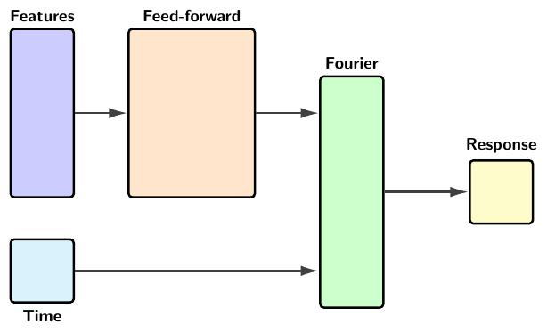

# Fourier shaped neural net

## Model

A periodic function $f(t)$ with period $T$, i.e. $f(t+T)=f(t)$, can be approximated, under mild conditions, as a sum of trigonometric functions:

$$
f(t) \approx c + 
\sum_{j=1}^\infty \left[ 
    a_j \sin \left( 2\pi\frac{n}{T}t \right) + 
    b_j \cos \left( 2\pi\frac{n}{T}t \right) 
    \right].
$$

Here we address the regression problem whereby $f$ can also depend on a collection of covariates $\mathbf{x}=(x_1,\ldots, x_k)$

$$
f(t;\mathbf{x}) \approx c(\mathbf{x}) + 
\sum_{j=1}^\infty \left[ 
    a_j(\mathbf{x}) \sin \left( \frac{2\pi j}{T}t \right) + 
    b_j(\mathbf{x}) \cos \left( \frac{2\pi j}{T}t \right) 
    \right].
$$

Given a number of harmonics $n$, a known period $T$, and a training dataset $\mathcal{D}$ consisting of timepoints, covariate values and responses

$$
\mathcal{D} = \{t_i, \mathbf{x}_i=(x_{i,1}, \ldots, x_{i, k}), y_i\}
$$

the model trains a feed-forward neural network $\Phi$ representing the Fourier coefficients as a function of the covariates

$$
\Phi(\mathbf{x}) = (c(\mathbf{x}), a_1(\mathbf{x}), \ldots, a_n(\mathbf{x}), b_1(\mathbf{x}), \ldots, b_n(\mathbf{x}) )
$$

that minimizes

$$
\sum_{i=1}^N \left[f_n(t_i; \mathbf{x}_i) - y_i\right]^2.
$$